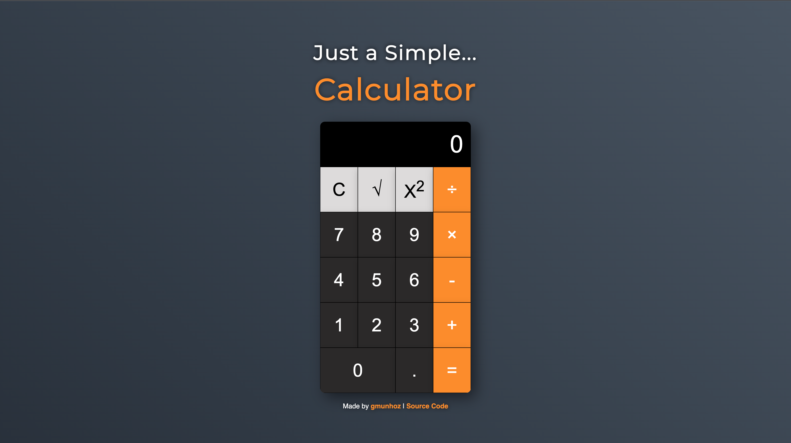

# Just a Simple... Calculator



Live: [https://gmunhoz0810.github.io/odin-calculator/](url)

This repository holds the source code for an iPhone-like calculator. Developed using vanilla JavaScript, HTML, and CSS, it emulates the key functionalities of a standard calculator including addition, subtraction, multiplication, and division. It also has a couple of extra functions such as the square root (√) and square (x²) operations.

The user interface of this calculator has been designed to match the sleek and simple design of the iPhone calculator, with the same layout and similar color scheme.

## Features

- Standard arithmetic operations (addition, subtraction, multiplication, division)
- Square root operation
- Squaring operation
- Live display of input and operation results
- Error handling (e.g., division by zero)
- Responsive design

## Getting Started

To get a local copy up and running, follow these simple steps:

1. Clone the repository

   ```bash
   git clone https://github.com/gmunhoz0810/odin-calculator.git
   ```

2. Navigate to the project directory

   ```bash
   cd odin-calculator
   ```

3. Open index.html in your favorite browser

## Code Overview

The calculator logic is handled by a JavaScript file, where various event listeners are set up for button clicks and specific operations are performed. The script handles number input, operations, clear functions, and updating the display.

The CSS file contains all the styling for the calculator, giving it its iPhone-like appearance. The layout is created using a combination of Flexbox and CSS grid.

The HTML file sets up the structure of the calculator, including the display area and buttons.

## Contributions

Contributions, issues, and feature requests are welcome. Feel free to check the [issues page](https://github.com/gmunhoz0810/odin-calculator/issues) if you want to contribute.

## Author

- [gmunhoz](https://github.com/gmunhoz0810)

## Show your support

Give a ⭐️ if you like this project!

## License

This project is MIT licensed.

## Acknowledgments

- [The Odin Project](https://www.theodinproject.com/about) for project requirements.

Thanks for checking out this project! If you want to say hi or have any questions, feel free to reach out on GitHub.
